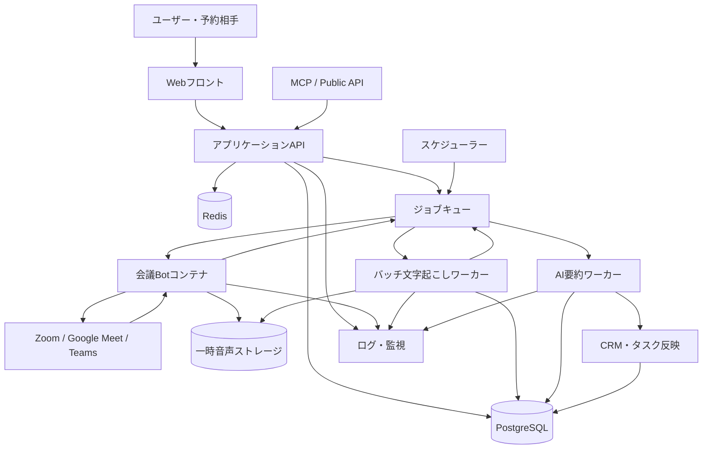
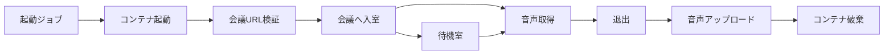
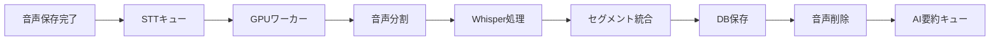
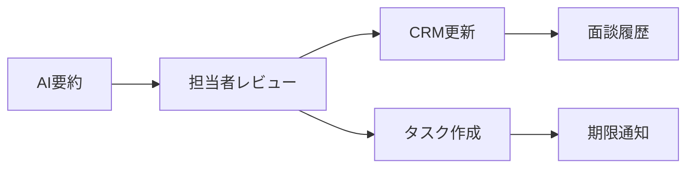
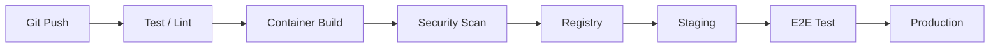
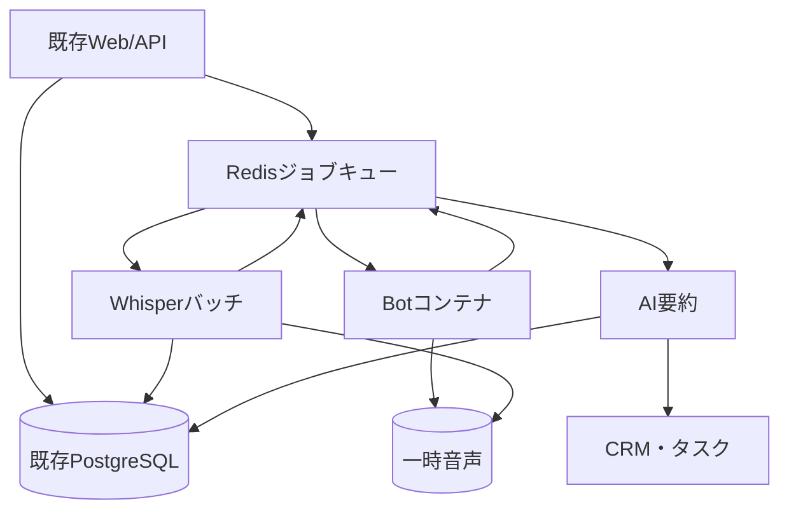
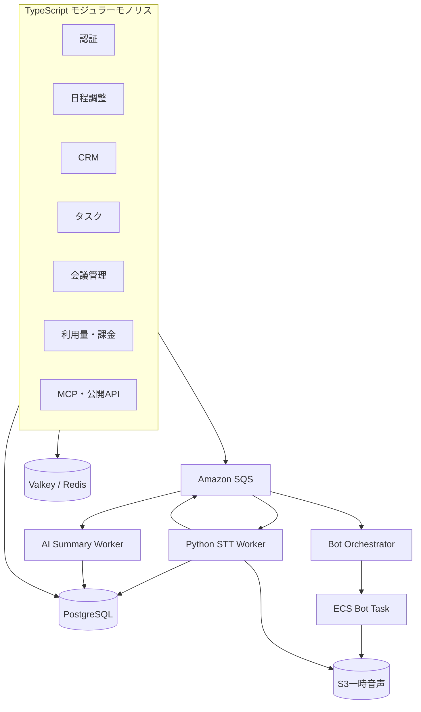
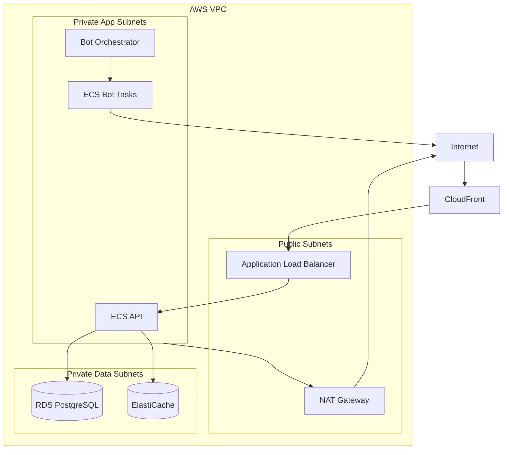

# キマル インフラ基盤構成
## 自作AI会議Bot・バッチ文字起こし・AI要約・CRM連携

作成日：2026年8月6日

[← AI会議Bot ドキュメント索引](./README.md)　|　[← docs 全体索引](../README.md)

> **2026-09-05 注記（#476）**: 本書は元設計（背景資料）で、Bot コンテナ＝Playwright + Chromium の前提で書かれている。**Zoom は RTMS（Realtime Media Streams）で音声を受けることに決まり、Zoom の会議に Bot は入室しない**（#370 / PR #473）。会議Bot の行（Playwright）は **先行する Meet** のみに当てはまり（#478）、23-3 の「Zoom 等のネイティブ SDK を直接利用する」ための C++ は不要になった。現行の設計は [`system-spec.md`](./system-spec.md) 9章・FR-2 を正とする。

### 対象機能

- 日程調整、CRM、タスク管理
- 自作会議Bot
- 音声のみ一時取得（動画保存なし）
- 会議終了後のバッチ文字起こし
- AI要約・タスク抽出・CRM反映
- 文字起こし保存1か月
- 音声は文字起こし完了後に削除
- 将来のMCP・公開API

---

# 1. 設計原則

1. 会議中だけBotコンテナを起動する
2. Web/APIとBot処理を分離する
3. 文字起こし・AI要約は非同期ジョブにする
4. 音声は一時保存し、処理後に削除する
5. テナント単位でデータを分離する
6. Bot、STT、LLMを交換可能な疎結合構成にする
7. 小規模では固定費を抑え、利用増加時に水平拡張する

---

# 2. 全体構成



---

# 3. コンポーネント一覧

| コンポーネント | 役割 | 初期構成 |
|---|---|---|
| Webフロント | 日程調整・CRM・管理画面 | 既存Web |
| API | 認証、予約、顧客、利用量、MCP | 既存APIを拡張 |
| PostgreSQL | 業務データの正本 | 既存DBを流用 |
| Redis | キュー、排他、同時接続制御 | 小規模1台 |
| スケジューラー | 会議開始前にBotジョブ発行 | APIと分離 |
| Botワーカー | 会議参加・音声取得 | 1会議1コンテナ |
| オブジェクトストレージ | 音声一時保存 | S3互換 |
| STTワーカー | Whisper系バッチ処理 | GPU 1台から |
| AIワーカー | 要約・JSON化 | 外部LLM API |
| 通知 | リマインド、完了・失敗通知 | メール＋アプリ内 |
| 監視 | 障害・性能・原価 | Sentry＋メトリクス |

---

# 4. 推奨データモデル

```text
tenants
users
customers
reservations
meetings
meeting_bots
meeting_participants
transcripts
transcript_segments
meeting_summaries
tasks
usage_counters
consent_logs
audit_logs
webhook_events
```

全業務テーブルに以下を持たせる。

```text
tenant_id
created_at
updated_at
deleted_at
```

### 会議テーブルの主要項目

```text
meeting_id
tenant_id
user_id
customer_id
reservation_id
meeting_url
meeting_platform
scheduled_start_at
scheduled_end_at
actual_start_at
actual_end_at
bot_status
transcription_status
summary_status
audio_deleted_at
transcript_expires_at
```

### テナント分離

- すべてのクエリに `tenant_id`
- 管理者操作も監査ログへ記録
- PostgreSQL Row Level Securityを検討
- BotにはCRM全体へアクセスさせない

---

# 5. ジョブキュー構成

```text
meeting-bot-schedule
meeting-bot-start
meeting-bot-stop
transcription
ai-summary
crm-sync
notification
cleanup
dead-letter
```

必須機能：

- ジョブIDによる重複防止
- 遅延実行
- 再試行と指数バックオフ
- Dead Letter Queue
- プレミアム優先度
- テナント別・ユーザー別の同時実行制御

---

# 6. 会議Bot基盤

## 処理フロー



## Botステータス

```text
scheduled
preparing
starting
joining
waiting_room
in_meeting
leaving
uploading
completed
failed
cancelled
timed_out
```

## 初期制限

| 項目 | 推奨値 |
|---|---:|
| 会議開始前の準備 | 3〜5分前 |
| 入室開始 | 1〜2分前 |
| 待機室上限 | 15分 |
| 最大会議時間 | 120分 |
| 1ユーザー同時Bot | 1台 |
| 再試行 | 1回 |
| 無人退出 | 5〜10分 |
| 動画 | 取得しない |

## エラーコード例

```text
INVALID_MEETING_URL
MEETING_NOT_STARTED
WAITING_ROOM_TIMEOUT
BOT_REJECTED
AUTH_REQUIRED
AUDIO_CAPTURE_FAILED
NETWORK_DISCONNECTED
UPLOAD_FAILED
DUPLICATE_BOT
MAX_DURATION_EXCEEDED
```

---

# 7. 同時接続制御

Redisに以下を持たせ、Bot起動時に原子的に枠を確保する。

```text
concurrency:global
concurrency:tenant:{tenant_id}
concurrency:user:{user_id}
```

### 混雑時の処理

1. 数十秒後に再試行
2. プレミアムを優先
3. 上限超過を画面とメールで通知
4. 起動不能時は管理者アラート
5. 全体同時接続数と会議時刻分布を計測

---

# 8. 音声保存・削除

## 保存方針

| データ | 保存期間 |
|---|---:|
| 正常音声 | 文字起こし成功後に即時削除 |
| 失敗時の音声 | 最大24〜72時間 |
| 文字起こし | 1か月 |
| AI要約 | CRM履歴として保持可能 |
| 動画 | 保存しない |
| 監査ログ | 6〜12か月を検討 |

オブジェクトキー例：

```text
tenant/{tenant_id}/meeting/{meeting_id}/audio/source.webm
```

### 削除対策

- 1時間ごとのクリーンアップジョブ
- ストレージ側のライフサイクル削除
- 削除成功・失敗を監査ログへ記録
- 退会時は即時削除ジョブを発行
- 音声をDBに保存しない

---

# 9. バッチ文字起こし基盤



## 初期構成

- GPUワーカー1台
- ジョブがある時だけ起動
- 1〜2ジョブ並列
- 失敗時1回再処理
- 長時間音声は分割
- キュー長で将来オートスケール

## ステータス

```text
queued
processing
merging
completed
failed
expired
```

## 文字起こし形式

```json
{
  "meeting_id": "mtg_001",
  "language": "ja",
  "duration_seconds": 3600,
  "segments": [
    {
      "speaker": "speaker_1",
      "participant_id": null,
      "start": 0.0,
      "end": 5.2,
      "text": "本日はよろしくお願いします。"
    }
  ]
}
```

初期はSpeaker 1 / Speaker 2とし、ユーザーが実名へ補正できるようにする。

---

# 10. AI要約基盤

## フロー

```text
文字起こし完了
↓
必要に応じ分割
↓
部分要約
↓
統合要約
↓
構造化JSON生成
↓
JSON Schema検証
↓
CRM反映候補作成
```

## 出力例

```json
{
  "summary": "",
  "decisions": [],
  "customer_needs": [],
  "concerns": [],
  "action_items": [
    {
      "title": "",
      "owner": "",
      "due_date": null
    }
  ],
  "next_meeting": {
    "required": false,
    "suggested_timing": null
  },
  "crm_updates": {
    "status": null,
    "tags": [],
    "next_action": null
  }
}
```

## 安全策

- 顧客IDをAIに推測させない
- 期限や担当者は候補扱い
- 初期は人間の承認後にCRM反映
- プロンプトとモデルのバージョンを記録
- 再要約回数をプランごとに制限

---

# 11. CRM・タスク連携



更新候補：

- 最終接触日
- 面談回数
- 面談要約
- 顧客ニーズ
- 商談ステータス
- 次回アクション
- タスク
- 顧客タグ
- 次回日程調整候補

---

# 12. 通知基盤

初期チャネル：

- メール
- アプリ内通知

通知イベント：

```text
meeting.reminder_24h
bot.join_failed
transcript.completed
summary.completed
crm.review_required
usage.reached_80_percent
usage.reached_100_percent
task.due
cleanup.failed
```

---

# 13. MCP・公開API

## スコープ例

```text
customers:read
customers:write
meetings:read
transcripts:read
summaries:read
tasks:read
tasks:write
scheduling:write
```

## MCPツール例

```text
search_customers
get_customer
list_upcoming_meetings
get_meeting_summary
list_tasks
create_task
create_scheduling_link
update_customer
```

APIキー・OAuth・レート制限・監査ログを必須とする。

---

# 14. セキュリティ

- TLS
- 保存時暗号化
- Secret Manager
- 最小権限IAM
- Webhook署名検証
- 管理者MFA
- テナント分離
- 監査ログ
- 入力値検証
- コンテナイメージスキャン
- 依存ライブラリ脆弱性監視
- 音声へのアクセスは署名付き短期URL

Botコンテナに渡す情報は以下に限定する。

```text
meeting_id
meeting_url
bot_name
start/end制限
一時アップロードURL
ステータス更新用トークン
```

---

# 15. 監視・アラート

| 対象 | 指標 |
|---|---|
| API | レスポンスタイム、5xx率 |
| DB | 接続数、CPU、容量 |
| Redis | メモリ、キュー長 |
| Bot | 起動・入室成功率、切断率 |
| STT | 待ち時間、GPU使用率、失敗率 |
| AI | 処理時間、JSON検証失敗率 |
| 削除 | 音声削除失敗数 |
| 原価 | 1会議時間当たりコスト |

重大アラート例：

- 入室成功率90%未満
- Bot失敗5件連続
- STTキュー30分超
- GPUワーカー停止
- 音声削除失敗
- テナント越境検知

---

# 16. バックアップ

## PostgreSQL

- 日次バックアップ
- Point-in-Time Recovery
- 7〜30日保持
- 月1回の復元試験

## Redis

- 正本として利用しない
- ジョブ状態をDBにも保存
- 消失時にDBから再投入可能にする

## 音声

- 一時データのためバックアップしない

## 文字起こし

- 1か月で削除
- バックアップ内の削除方針も定義する

---

# 17. リポジトリ・CI/CD

```text
apps/web
apps/api
apps/bot-worker
apps/transcription-worker
apps/ai-summary-worker
apps/scheduler
packages/database
packages/queue
packages/contracts
packages/observability
infra
```



環境：

- local
- development
- staging
- production

---

# 18. 段階別構成

## Stage 1：PoC

| 項目 | 内容 |
|---|---|
| 対象 | 運営者限定 |
| 会議サービス | 1種類 |
| 同時Bot | 1〜3 |
| 月間会議時間 | 100〜500時間 |
| API・DB | 既存基盤 |
| Redis | 小規模1台 |
| STT | GPU 1台・必要時起動 |
| 月額目安 | 3万〜10万円 |

## Stage 2：ベータ公開

| 項目 | 内容 |
|---|---|
| 有料ユーザー | 100〜1,000 |
| 同時Bot | 5〜10 |
| 月間会議時間 | 500〜2,000時間 |
| API | 2コンテナ |
| DB | マネージドPostgreSQL |
| Bot | オートスケール |
| STT | GPU 1〜2台 |
| 月額目安 | 5万〜15万円 |

## Stage 3：正式公開

| 項目 | 内容 |
|---|---|
| 登録者 | 1,000〜10,000 |
| 同時Bot | 10〜100 |
| 月間会議時間 | 1,000〜10,000時間 |
| API・DB | 複数AZ |
| Bot | ECS/Kubernetes等 |
| STT | GPUオートスケール |
| セキュリティ | WAF・Secret Manager |
| 月額目安 | 10万〜40万円 |

## Stage 4：大規模

| 項目 | 内容 |
|---|---|
| 登録者 | 10,000〜100,000 |
| 同時Bot | 100〜1,000 |
| 月間会議時間 | 1万〜10万時間 |
| Bot | 専用クラスタ |
| STT | GPU専用クラスタ |
| キュー | 用途・優先度別分割 |
| 可用性 | 複数AZ、必要時複数リージョン |
| 月額目安 | 30万〜300万円以上 |

---

# 19. MVP構成



### MVPで実装しないもの

- 動画録画
- リアルタイム文字起こし
- リアルタイム営業支援
- 複数Bot同時利用
- Teams対応
- 完全自動CRM反映
- 長期音声保存
- SSO
- 複数リージョン

---

# 20. 構築順序

## Step 1：Bot基盤

- 会議・Botテーブル
- Redis・ジョブキュー
- Bot起動・停止
- 状態管理
- 同時接続制御

## Step 2：音声・STT

- 音声取得
- 一時ストレージ
- バッチ文字起こし
- 音声削除
- 文字起こし画面

## Step 3：AI・CRM

- AI要約
- JSON Schema
- タスク候補
- CRM反映候補
- 承認画面

## Step 4：本番運用

- 利用時間集計
- プラン制限
- 監視・アラート
- 管理者画面
- バックアップ
- セキュリティ強化

## Step 5：プレミアム

- MCP
- 公開API
- Webhook
- 法人権限
- SLA

---

# 21. 最終推奨構成

| 項目 | 初期推奨 |
|---|---|
| 会議サービス | Google MeetまたはZoomの1つ |
| Bot | 1会議1コンテナ |
| 動画 | 取得しない |
| 音声 | 一時保存 |
| 文字起こし | 会議後バッチ |
| AI要約 | 非同期 |
| CRM反映 | 担当者承認後 |
| 同時Bot | 10以下 |
| 文字保存 | 1か月 |
| 音声削除 | 文字起こし成功後 |
| 初期月額予算 | 3万〜10万円 |

PoCでは、入室成功率、音声欠損率、文字起こし速度、ピーク同時接続、1会議時間当たり原価を必ず計測する。


---

# 22. 採用するクラウド・技術スタック

## 結論

MVPから正式公開初期までは、次の構成を推奨する。

| 層 | 推奨技術 |
|---|---|
| クラウド | AWS・東京リージョン |
| Web | Next.js + TypeScript |
| 業務API | TypeScript + Fastify、または既存APIを継続 |
| Botオーケストレーター | TypeScript |
| 会議Bot | TypeScript + Playwright + Chromium |
| 文字起こし | Python + faster-whisper + FFmpeg |
| AI要約 | TypeScriptからLLM APIを呼び出す |
| DB | Amazon RDS for PostgreSQL |
| 非同期キュー | Amazon SQS |
| 予約起動 | Amazon EventBridge Scheduler |
| 排他・レート制限 | ElastiCache for Valkey / Redis OSS |
| Bot実行 | Amazon ECS + Fargateを第一候補 |
| GPU文字起こし | GPU EC2、またはGPUクラウド |
| 音声一時保存 | Amazon S3 |
| コンテナ保管 | Amazon ECR |
| シークレット | AWS Secrets Manager |
| 監視 | CloudWatch + Sentry |
| IaC | Terraform |
| CI/CD | GitHub Actions |

AWS Fargateは、EC2インスタンスやクラスタを直接管理せずにECSコンテナを実行できるため、会議時だけBotを起動する初期構成に適している。RDS for PostgreSQLはバックアップ、ポイントインタイム復元、Multi-AZ等を提供する。EventBridge Schedulerは一回限りのスケジュールを含むタスク起動を管理できる。

---

# 23. 推奨プログラミング言語

## 23-1. TypeScript

以下はTypeScriptへ統一する。

- Webフロントエンド
- 業務API
- 認証・権限
- 日程調整
- CRM
- タスク管理
- Bot予約・起動制御
- Playwright会議Bot
- AI要約API呼び出し
- MCP
- 公開API
- Webhook
- 利用量・課金制御

### TypeScriptを推奨する理由

- フロントとバックエンドで型を共有できる
- 会議・顧客・タスクのデータ契約を共通化しやすい
- Playwrightとの親和性が高い
- Codexと共同開発する際に、単一言語へ寄せやすい
- MCP・REST API・Webhookを同じ型定義で管理できる

### 推奨ライブラリ

| 用途 | 推奨 |
|---|---|
| HTTP API | Fastify |
| 入力検証 | Zod |
| DBアクセス | Drizzle ORM、または既存ORM |
| API仕様 | OpenAPI |
| Bot操作 | Playwright |
| ログ | Pino |
| テスト | Vitest |
| E2E | Playwright Test |
| MCP | 公式MCP SDK |
| 日時 | Temporal API対応ライブラリ、またはdate-fns |

既存システムがNestJS、Express等で安定している場合は、無理にFastifyへ変更しない。  
最も重要なのは、会議・顧客・タスクの型を共有することである。

---

## 23-2. Python

Pythonは文字起こしワーカーに限定する。

- FFmpegによる音声前処理
- 音声分割
- faster-whisper
- GPU推論
- 話者分離を追加する場合のML処理
- 文字起こし品質評価

### 推奨ライブラリ

| 用途 | 推奨 |
|---|---|
| STT | faster-whisper |
| 音声処理 | FFmpeg |
| API・ヘルスチェック | FastAPI |
| データ検証 | Pydantic |
| ジョブ受信 | boto3 / SQS |
| GPU | CUDA対応コンテナ |
| テスト | pytest |

faster-whisperはCTranslate2を利用したWhisper実装で、CPU・GPU環境の双方を構成できる。

---

## 23-3. Rust・C++を使うタイミング

MVPでは採用しない。

以下がボトルネックになった場合のみ検討する。

- Chromiumでは音声取得が不安定
- 1BotあたりのCPU・メモリを大幅に削減したい
- Zoom等のネイティブSDKを直接利用する
- 数百〜数千Botを同時稼働する
- メディアストリーム処理の遅延が問題になる

初期から多言語化すると開発・デバッグ負荷が増えるため、まずTypeScriptとPythonの2言語に限定する。

---

# 24. 推奨アーキテクチャ

## 24-1. モジュラーモノリス＋非同期ワーカー

最初から全面的なマイクロサービスにはしない。



### モジュラーモノリスを推奨する理由

- 1〜2人開発で変更箇所を追いやすい
- トランザクション管理が簡単
- CRM・予約・タスクの整合性を保ちやすい
- デプロイ対象を増やしすぎない
- 必要になったモジュールだけ後から分離できる

### 最初から分離する処理

以下だけは別プロセス・別コンテナにする。

1. 会議Bot
2. バッチ文字起こし
3. AI要約
4. クリーンアップ

これらはCPU、メモリ、GPU、実行時間、障害特性が業務APIと異なるためである。

---

## 24-2. イベント駆動

サービス間で直接連鎖的にHTTPを呼び続けず、SQSイベントを中心に処理する。

```text
meeting.scheduled
bot.start.requested
bot.joined
bot.completed
audio.uploaded
transcription.requested
transcription.completed
summary.requested
summary.completed
crm.review_required
audio.delete.requested
```

### 利点

- 一時障害でも再処理できる
- Bot障害がCRMへ波及しない
- GPU不足時にキューへ待機できる
- 各処理を個別にスケールできる
- Dead Letter Queueで失敗を隔離できる

---

# 25. AWS構成詳細

## 25-1. ネットワーク



### 注意点

会議BotはZoom・Meet等へ外向き通信する必要がある。  
Botをプライベートサブネットへ配置する場合、NAT Gatewayの通信費が増えるため、PoCでは以下を比較する。

- パブリックIP付きFargateタスク
- プライベートサブネット＋NAT
- Bot専用EC2

本番ではセキュリティと通信費を実測して決定する。

---

## 25-2. API実行環境

### 初期

- ECS Fargate
- 最小1〜2タスク
- ALB配下
- CPU使用率・リクエスト数でスケール

### 代替

既存キマルがVercel等で安定している場合：

- フロントはVercelを継続
- 業務APIとBot基盤だけAWSへ移行
- 一度に全面移行しない

---

## 25-3. Bot実行環境

### 第一候補：ECS Fargate

向いている段階：

- 同時1〜50Bot程度
- Botを会議時間だけ起動
- サーバー管理を減らしたい
- まず原価と安定性を測りたい

### 第二候補：ECS on EC2

切り替えを検討する条件：

- 月間Bot時間が増え、Fargate単価が高い
- Chromiumのメモリ最適化が進んだ
- 1台に複数Botを効率的に詰めたい
- 同時50〜100Botを継続的に超える

### Kubernetesを採用する条件

以下を複数満たした後にEKS等を検討する。

- 同時100〜300Bot以上
- BotとGPUの複雑なオートスケールが必要
- 複数の開発・運用担当者がいる
- 複数リージョンを運用する
- ECSでの制御が明確な制約になった

Kubernetesはコンテナ化されたワークロードの管理とスケールに適する一方、プロダクション環境ではコントロールプレーン、ワーカーノード、認可、リソース管理等の運用項目が増える。MVPでは採用しない。

---

## 25-4. 会議開始スケジューリング

### 推奨

```text
予約確定
↓
EventBridge Schedulerに一回限りの実行予定を作成
↓
開始3〜5分前にSQSへメッセージ
↓
Bot OrchestratorがECS RunTask
```

EventBridge Schedulerは、一回限りまたは定期的な実行を管理でき、再試行設定も持つため、会議ごとの起動予約に適している。

### キャンセル・変更

- 会議時間変更時：既存スケジュールを更新
- キャンセル時：スケジュール削除
- 二重登録防止：`meeting_id` を一意キーにする

---

## 25-5. キュー

### 推奨：Amazon SQS

| キュー | 用途 |
|---|---|
| bot-start | Bot起動 |
| bot-events | Bot状態 |
| transcription | STT |
| summary | AI要約 |
| crm-sync | CRM反映 |
| cleanup | 削除 |
| notifications | 通知 |

### Redisの役割

Redisは主キューではなく、以下へ限定する。

- 同時接続カウンター
- 分散ロック
- 短期キャッシュ
- レート制限
- セッション

SQSを正本キューにすることで、Redis障害時のジョブ消失リスクを抑える。

---

## 25-6. データベース

### 推奨：RDS for PostgreSQL

初期：

- Single-AZ
- 自動バックアップ
- Point-in-Time Recovery
- 開発・本番DBを分離

正式公開後：

- Multi-AZ
- Performance Insights
- 接続プール
- 読み取り負荷増加時にリードレプリカ検討

RDS for PostgreSQLはバックアップ、スナップショット、ポイントインタイム復元、Multi-AZ、リードレプリカ等を利用できる。

---

## 25-7. ストレージ

### S3バケット分割

```text
kimaru-audio-temporary
kimaru-transcript-export
kimaru-application-assets
kimaru-audit-archive
```

### 音声バケット

- パブリックアクセス禁止
- 暗号化
- 署名付きURL
- 24〜72時間のライフサイクル削除
- 文字起こし成功時に即時削除
- 本番とステージングを分離

---

## 25-8. GPU文字起こし

### 初期推奨

- Python
- faster-whisper
- GPUワーカーはBot基盤から分離
- 会議終了後にSQSから取得
- 音声時間より高速に処理できるモデルを選ぶ

### インフラ選択

| 選択肢 | 向く段階 |
|---|---|
| GPUクラウド | PoC・利用量が不安定 |
| GPU EC2を必要時起動 | AWSへ統一したい |
| 常時GPU EC2 | キューが常時ある |
| GPUオートスケール群 | 大規模 |

GPU Spotは中断される可能性があるため、バッチSTTには利用可能だが、チェックポイントまたはジョブ再実行を前提とする。

---

# 26. サービス境界

## 業務APIモジュール

```text
Auth
Tenant
User
Customer
Scheduling
Meeting
Task
Billing
Notification
MCP
PublicAPI
```

## 独立ワーカー

```text
BotOrchestrator
MeetingBot
TranscriptionWorker
SummaryWorker
CleanupWorker
NotificationWorker
```

### 共有するもの

- OpenAPI契約
- イベントスキーマ
- DBスキーマ
- エラーコード
- 監視フィールド
- テナントID規則

### 共有しないもの

- Botのブラウザ状態
- GPUモデル
- 一時音声
- 各ワーカーの内部実装

---

# 27. リポジトリ構成案

```text
kimaru/
├─ apps/
│  ├─ web/
│  ├─ api/
│  ├─ scheduler/
│  ├─ bot-orchestrator/
│  ├─ meeting-bot/
│  ├─ summary-worker/
│  └─ mcp-server/
├─ services/
│  └─ transcription-worker/
├─ packages/
│  ├─ contracts/
│  ├─ database/
│  ├─ auth/
│  ├─ observability/
│  ├─ queue/
│  └─ config/
├─ infra/
│  ├─ terraform/
│  └─ docker/
└─ docs/
```

Pythonワーカー：

```text
services/transcription-worker/
├─ app/
│  ├─ worker.py
│  ├─ transcribe.py
│  ├─ audio.py
│  └─ schemas.py
├─ tests/
├─ Dockerfile
└─ pyproject.toml
```

---

# 28. API・イベント契約

## イベント例

```json
{
  "event_id": "evt_001",
  "event_type": "transcription.completed",
  "event_version": 1,
  "tenant_id": "tenant_001",
  "meeting_id": "meeting_001",
  "occurred_at": "2026-08-06T00:00:00Z",
  "payload": {
    "transcript_id": "transcript_001"
  }
}
```

## 必須フィールド

```text
event_id
event_type
event_version
tenant_id
meeting_id
occurred_at
correlation_id
payload
```

イベントの変更時は既存フィールドを破壊せず、`event_version` を更新する。

---

# 29. ローカル開発環境

Docker Composeで以下を起動する。

```text
PostgreSQL
Valkey / Redis
LocalStackまたはSQS互換
MinIO
API
Bot Orchestrator
Meeting Bot
STT Worker
AI Summary Worker
```

### ローカルと本番の差を小さくする

- すべてDocker化
- 環境変数名を統一
- AWS依存箇所をAdapter化
- S3、Queue、LLM、STTへインターフェースを設ける

---

# 30. インフラのコード化

## 推奨：Terraform

管理対象：

- VPC
- Subnet
- Security Group
- ECS
- ECR
- RDS
- ElastiCache
- SQS
- EventBridge Scheduler
- S3
- IAM
- Secrets Manager
- CloudWatch

### 理由

- クラウド構成をコードレビューできる
- ステージングと本番を再現できる
- 手動設定漏れを防げる
- 将来一部を別クラウドへ移す際にも考え方を流用しやすい

---

# 31. 技術選定の最終判断

## MVP

```text
Next.js + TypeScript
TypeScript API
Playwright Bot
Amazon ECS Fargate
Amazon SQS
EventBridge Scheduler
RDS PostgreSQL
ElastiCache Valkey / Redis
S3
Python + faster-whisper
外部LLM API
Terraform
GitHub Actions
```

## 正式公開後

```text
API：ECS Fargateを水平拡張
Bot：FargateからECS on EC2への移行を原価で判断
STT：GPUワーカーをオートスケール
DB：RDS Multi-AZ
Queue：SQS + DLQ
監視：CloudWatch + Sentry
```

## 大規模化後

```text
Bot専用ECSクラスタ
GPU専用クラスタ
キュー分割
複数AZ
法人向け専用環境
必要性が明確になった場合のみKubernetes
```

---

# 32. 採用しない構成

MVPでは以下を採用しない。

| 非推奨 | 理由 |
|---|---|
| 最初からKubernetes | 運用対象が増えすぎる |
| 全機能マイクロサービス | 1〜2人開発には複雑 |
| すべてPython | Web、MCP、Bot制御の型共有が弱い |
| すべてTypeScript | GPU・音声ML処理はPythonが扱いやすい |
| Redisだけを永続キューにする | 障害復旧設計が複雑になる |
| BotとAPIを同じコンテナで動かす | Bot障害が業務APIへ波及する |
| 音声をDBへ保存 | DB肥大化と削除管理が難しい |
| リアルタイムSTT | 現在の要件では費用対効果が低い |
| 動画保存 | ストレージ・通信・個人情報リスクが増える |

---

# 33. 実装開始時の技術タスク

## 第1週

- [ ] モノレポ作成
- [ ] TypeScript共通型パッケージ
- [ ] TerraformのAWS基盤
- [ ] ECR・ECSのHello World
- [ ] SQS・DLQ
- [ ] EventBridge SchedulerからSQSへの試験
- [ ] RDS接続
- [ ] S3署名付きアップロード

## 第2週

- [ ] Bot Orchestrator
- [ ] ECS RunTask
- [ ] Botの状態イベント
- [ ] Redis同時接続ロック
- [ ] Playwright Botの会議入室PoC
- [ ] CloudWatchログ

## 第3〜4週

- [ ] 音声一時保存
- [ ] Python STTワーカー
- [ ] faster-whisper
- [ ] 文字起こし完了イベント
- [ ] 音声削除
- [ ] AI要約ワーカー
- [ ] CRM反映候補

---

# 34. 技術選定サマリー

| 判断項目 | 採用 |
|---|---|
| 基本言語 | TypeScript |
| 音声AI言語 | Python |
| アプリ構造 | モジュラーモノリス |
| 重い処理 | 独立非同期ワーカー |
| 通信 | REST + イベント |
| 永続キュー | SQS |
| 排他・キャッシュ | Valkey / Redis |
| Bot | Playwright + Chromium |
| 初期オーケストレーション | ECS Fargate |
| 大規模時 | ECS on EC2、必要時のみEKS |
| STT | faster-whisper |
| DB | RDS PostgreSQL |
| 音声 | S3一時保存 |
| IaC | Terraform |
| CI/CD | GitHub Actions |

この構成は、少人数で開発・運用できる単純さを維持しながら、Bot、文字起こし、AI要約を個別にスケールできる。
